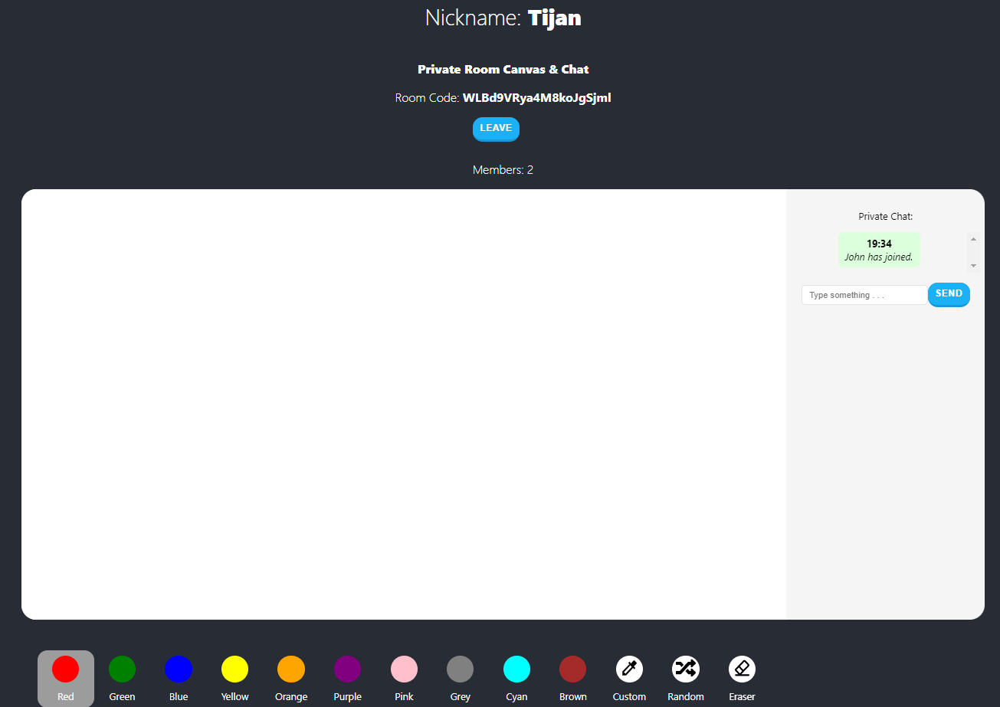

# Collaborative Whiteboard App
Is a online collaborative whiteboard app, where users can draw and chat on a public whiteboard or create their own private rooms with private chat and private whiteboard visible only to them. They can than share their private room code and other people will be able to join. They can also download the whiteboard as an image or mint it as an NFT (on mumbai testnet network).

## Technologies
For this project I used:
- [React](https://reactjs.org/) - framework I used to create frontend
- [TypeScript](https://www.typescriptlang.org/) - used in frontend
- [Solidity](https://soliditylang.org/) - for NFT smart contract
- [Moralis](https://moralis.io/) - for connecting wallet, uploading to IPFS and minting NFT
- [CSS](https://developer.mozilla.org/en-US/docs/Web/CSS)
- [NodeJS](https://nodejs.org/en/) and
- [Socket.io](https://socket.io/) - both to create backend

## Author
Created by [Tijan](https://github.com/0xTijan).
